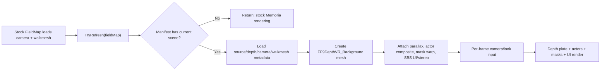

# Stock Memoria vs FFIX3DVR Annotated Comparison

This document explains what the FFIX3DVR alpha changes relative to a stock Memoria source tree, why each hook exists, and how the added runtime renderer works. It is written for manual review and for answering the common question: "Is this a Memoria mod, an upstream Memoria change, or a patched game assembly?"

## Scope And Source References

Reference points used for this comparison:

- Stock source: `.external/Memoria/Assembly-CSharp` from local Memoria checkout `f45f814`.
- FFIX3DVR patched source: `.memoria-src/Assembly-CSharp`.
- Patch mirror copied into releases: `memoria-patch-source/FF9DepthVRFieldRenderer.cs`.
- Runtime data expected by the patch: `StreamingAssets/Data/FF9DepthVR/manifest.json` plus per-scene depth, walkmesh, camera, and generated metadata.

The C# patch surface is intentionally small:

- One new source file: `Memoria/FF9DepthVR/FF9DepthVRFieldRenderer.cs`.
- One project-file include/reference change: `Assembly-CSharp.csproj`.
- Nine stock Memoria C# files receive short hooks into the new renderer.

The browser viewer, packaging scripts, ComfyUI/Depth-Anything tooling, generated depth data, and release automation are outside the line-by-line C# comparison here, though they are part of the repository.

## Short Answer For Reviewers

This alpha is currently a patched Memoria/FFIX `Assembly-CSharp.dll` plus an asset/data package. It is not yet a clean upstream Memoria pull request, and it is not yet a fully self-contained loose-file Memoria mod.

The design keeps stock Memoria behavior as the baseline. The stock files mostly add narrow calls such as `FF9DepthVRFieldRenderer.TryRefresh(this)` or `TryWorldToSbsUiScreenPoint(...)`. The large behavior lives in one namespaced file, `Memoria.FF9DepthVR.FF9DepthVRFieldRenderer`, so reviewers can audit the integration surface separately from the experimental depth/SBS implementation.

The public release package is sanitized. It does not include copyrighted FFIX color plates, original FMV frames, game binaries, or Steam files. A local install needs a legally owned game copy and locally generated/extracted assets.

## Modified File Inventory

| File | Stock status | FFIX3DVR change | Reason |
| --- | --- | --- | --- |
| `Assembly-CSharp.csproj` | Compiles stock Memoria sources | Adds `Memoria\FF9DepthVR\FF9DepthVRFieldRenderer.cs` and local reference hints | Include the new runtime renderer in the patched DLL build |
| `Global/Field/Map/FieldMap.cs` | Loads field camera, walkmesh, and background | Calls `TryRefresh(this)` after camera/walkmesh setup | Create or refresh the depth replacement plate only when the field is ready |
| `Memoria/Application/SmoothFrameUpdater_Field.cs` | Smooths field camera/actor/background motion | Calls `ApplyActorDepthOffsets()` after smooth update | Keep actor feet and shadows pinned to reprojected field positions during camera motion |
| `Global/SPS/SPSEffect.cs` | Projects SPS effects using stock GTE math | Lets FFIX3DVR adjust projected local positions | Keep candles, fire, and small field effects locked to the same depth surface as actors |
| `Global/Model/Button/ModelButton.cs` | Projects world targets to screen using one camera | Uses SBS-aware projection when active | Keep battle/world target buttons and selector anchors correct in SBS |
| `Global/UI/UIFollowTarget.cs` | Follows world targets using `WorldToScreenPoint` | Uses SBS-aware projection when active | Keep dialogue bubbles and follow-target UI duplicated/positioned per eye |
| `Global/UI/UICamera.cs` | Mouse/touch coordinates use full screen | Remaps right-eye input into left-half UI coordinates in SBS | Let clicks/touches work on either half of the SBS screen |
| `Global/UI/UIKey/UIKeyTrigger.cs` | F9 can be used by stock turbo dialog | Sends F7/F8/F9 to FFIX3DVR and prevents same-frame turbo conflict | Keep SBS/VR/actor-look toggles from also triggering stock F9 behavior |
| `Global/UI/UIManager.cs` | Creates menu/battle UI cameras | Adds SBS UI and battle stereo components | Duplicate UI cameras and enable battle SBS support |
| `Global/MBG.cs` | Plays stock FMV/MBG movie planes and masks | Adds SBS movie cameras/UI, native movie plane scaling, movie BG plate hooks, material restoration | Keep FMVs visible in SBS, preserve masks/materials, and provide experimental depth-FMV path |

## Project File Changes

Stock Memoria already references Newtonsoft through a package reference, but the local patched build also needs explicit reference paths in this workspace. The key functional line is the compile include for the new renderer.

```xml
<!-- .memoria-src/Assembly-CSharp/Assembly-CSharp.csproj -->
<Reference Include="System.Runtime.Serialization">
  <HintPath>$(SystemRoot)\Microsoft.NET\Framework\v3.0\Windows Communication Foundation\System.Runtime.Serialization.dll</HintPath>
  <Private>True</Private>
</Reference>

<Reference Include="Newtonsoft.Json">
  <HintPath>..\References\Newtonsoft.Json.dll</HintPath>
  <Private>True</Private>
</Reference>

<Compile Include="Memoria\FF9DepthVR\FF9DepthVRFieldRenderer.cs" />
```

Line-by-line intent:

- `System.Runtime.Serialization` hint: makes the local non-Unity/MSBuild environment resolve an assembly stock Memoria expects indirectly.
- `Newtonsoft.Json` hint: makes the local patched build resolve JSON support from the Memoria reference folder.
- `Compile Include="Memoria\FF9DepthVR\FF9DepthVRFieldRenderer.cs"`: adds the FFIX3DVR runtime source to `Assembly-CSharp.dll`.

No gameplay behavior changes happen from the project file alone. It only makes the added code build.

## FieldMap Hook

Stock Memoria builds the field camera, walkmesh, projected walkmesh, and scene state in `FieldMap`. FFIX3DVR adds a refresh call at the two points where those structures are ready.

```csharp
// .memoria-src/Assembly-CSharp/Global/Field/Map/FieldMap.cs
this.walkMesh.ProcessBGI();
this.walkMesh.UpdateActiveCameraWalkmesh();
Memoria.FF9DepthVR.FF9DepthVRFieldRenderer.TryRefresh(this);
```

```csharp
// .memoria-src/Assembly-CSharp/Global/Field/Map/FieldMap.cs
this.walkMesh.CreateProjectedWalkMesh();
this.walkMesh.BGI_simInit();
Memoria.FF9DepthVR.FF9DepthVRFieldRenderer.TryRefresh(this);
```

Line-by-line intent:

- Stock walkmesh and camera code remains first. FFIX3DVR needs the same camera and walkmesh Memoria already uses.
- `TryRefresh(this)` is a guarded entry point. It loads the manifest if needed, checks the current scene name, and returns without replacing anything when no FFIX3DVR scene asset exists.
- The hook is placed after camera/walkmesh initialization so the depth plate can match the field camera and actor projection instead of guessing from map ID alone.

## Smooth Field Update Hook

Stock Memoria smooths field camera and actor transforms. FFIX3DVR runs actor pinning after that smoothing pass.

```csharp
// .memoria-src/Assembly-CSharp/Memoria/Application/SmoothFrameUpdater_Field.cs
if (mainCamera != null && (_cameraPosActual - _cameraPosPrevious).sqrMagnitude < CameraSmoothMovementMaxSqr)
    mainCamera.transform.position = Vector3.Lerp(_cameraPosPrevious, _cameraPosActual, smoothFactor);

FF9DepthVR.FF9DepthVRFieldRenderer.ApplyActorDepthOffsets();
```

Line-by-line intent:

- Stock camera interpolation still owns the actual camera transform.
- `ApplyActorDepthOffsets()` runs after interpolation so actors, shadows, and related field renderers are pinned against the final camera state for this frame.
- This prevents the "actor slips when the camera pivots" failure mode caused by applying depth offsets before the camera reaches its smoothed position.

## SPS Effect Hook

SPS effects are small projected field effects, such as candles/fire in some scenes. Stock Memoria computes a projected position through PSX/GTE math. FFIX3DVR keeps that calculation, then gives the depth renderer one chance to correct the local position.

```csharp
// .memoria-src/Assembly-CSharp/Global/SPS/SPSEffect.cs
Vector3 projectedPos = PSX.CalculateGTE_RTPT_POS(...);
scalef *= currentBgCamera.GetViewDistance() / projectedPos.z;
if (projectedPos.z < 0f)
    isBehindCamera = true;

Vector3 localPos = projectedPos;
localPos.z = projectedPos.z / 4f + currentBgCamera.depthOffset;
Memoria.FF9DepthVR.FF9DepthVRFieldRenderer.TryAdjustFieldSpsLocalPosition(this.fieldMap, projectedPos, ref localPos);
base.transform.localPosition = new Vector3(localPos.x, localPos.y, localPos.z + this.depthOffset);
```

Line-by-line intent:

- `projectedPos` preserves the stock PSX projection result.
- Scale and behind-camera checks still use stock depth.
- `localPos` begins as the stock local position.
- `TryAdjustFieldSpsLocalPosition(...)` only mutates `localPos` when an active FFIX3DVR actor/depth composite can map the effect onto the depth plate.
- Final transform assignment remains stock-shaped, so non-depth fields and unsupported scenes behave as before.

## World-To-UI Projection Hooks

Stock Memoria places several UI elements by projecting a world position into screen space. In SBS, a single full-width `WorldToScreenPoint` gives wrong results for right-eye cameras and half-screen viewports. FFIX3DVR centralizes the fix in `TryWorldToSbsUiScreenPoint(...)`.

Model buttons:

```csharp
// .memoria-src/Assembly-CSharp/Global/Model/Button/ModelButton.cs
Vector3 position;
if (!Memoria.FF9DepthVR.FF9DepthVRFieldRenderer.TryWorldToSbsUiScreenPoint(this.worldCam, this.worldTopPos, out position))
    position = this.worldCam.WorldToScreenPoint(this.worldTopPos);
```

Follow-target UI:

```csharp
// .memoria-src/Assembly-CSharp/Global/UI/UIFollowTarget.cs
Vector3 followWorldPosition = this.lastPosition + this.targetTransformOffset;
Vector3 screenPos;
if (!Memoria.FF9DepthVR.FF9DepthVRFieldRenderer.TryWorldToSbsUiScreenPoint(this.worldCam, followWorldPosition, out screenPos))
    screenPos = this.worldCam.WorldToScreenPoint(followWorldPosition);
```

Line-by-line intent:

- The new method is attempted first only because it can detect whether SBS is active.
- When SBS is inactive, or when FFIX3DVR cannot project the point, the stock `WorldToScreenPoint` path is used.
- This keeps the battle hand cursor, target UI, and dialogue/follow bubbles aligned in SBS without rewriting the UI systems.

## Pointer Input Remap

Stock NGUI input treats the screen as one full-width UI surface. In SBS mode the same UI appears on both halves, so a click on the right half needs to behave like the equivalent click on the left half.

```csharp
// .memoria-src/Assembly-CSharp/Global/UI/UICamera.cs
private static Vector2 RemapSbsPointerPosition(Vector2 position)
{
    if (!Memoria.FF9DepthVR.FF9DepthVRFieldRenderer.SbsEnabled || Screen.width <= 1)
        return position;

    Single halfWidth = Screen.width * 0.5f;
    if (position.x >= halfWidth)
        position.x -= halfWidth;
    return position;
}
```

Call sites replace raw input positions:

```csharp
Vector2 mousePosition = UICamera.RemapSbsPointerPosition(UnityXInput.Input.mousePosition);
position = UICamera.RemapSbsPointerPosition(touch.position);
```

Line-by-line intent:

- Early return preserves stock input in 2D mode.
- `halfWidth` defines the left/right SBS split.
- Right-half input has `halfWidth` subtracted, so the right UI clone receives the same logical coordinates as the left UI.
- Left-half input is unchanged.

## F7/F8/F9 Input Hook

Stock Memoria can use F9 for turbo dialog. FFIX3DVR also uses F9 to cycle view mode. The hook handles FFIX3DVR toggles first and prevents same-frame turbo activation when FFIX3DVR consumed F9.

```csharp
// .memoria-src/Assembly-CSharp/Global/UI/UIKey/UIKeyTrigger.cs
GameLoopManager.RaiseUpdateEvent();
Memoria.FF9DepthVR.FF9DepthVRFieldRenderer.TryHandleSbsToggleInput();
if (Memoria.FF9DepthVR.FF9DepthVRFieldRenderer.WasSbsToggleInputHandledThisFrame)
    TurboKey = false;
```

```csharp
if (UnityXInput.Input.GetKeyDown(KeyCode.F9) &&
    Configuration.Control.TurboDialog &&
    !Memoria.FF9DepthVR.FF9DepthVRFieldRenderer.WasSbsToggleInputHandledThisFrame)
{
    ...
}
```

Line-by-line intent:

- `TryHandleSbsToggleInput()` is the central keyboard pump for FFIX3DVR: F9 view mode, F8 actor-look assist, and F7 VR capture mode.
- `WasSbsToggleInputHandledThisFrame` records whether F9 was consumed this frame.
- Turbo dialog is left intact when FFIX3DVR did not consume F9.
- When FFIX3DVR did consume F9, the turbo state is cleared instead of toggled accidentally.

## UIManager Hooks

Stock `UIManager` creates the main UI and battle camera setup. FFIX3DVR adds components to duplicate UI output and to create battle stereo cameras.

```csharp
// .memoria-src/Assembly-CSharp/Global/UI/UIManager.cs
base.gameObject.EnsureExactComponent<Memoria.FF9DepthVR.FF9DepthVRSbsUiStereo>().Initialize();
```

```csharp
cameraObject.EnsureExactComponent<Memoria.FF9DepthVR.FF9DepthVRBattleStereo>();
cameraObject.EnsureExactComponent<Memoria.FF9DepthVR.FF9DepthVRSbsUiStereo>().Initialize();
```

Line-by-line intent:

- `EnsureExactComponent` is used to avoid adding duplicate components.
- `FF9DepthVRSbsUiStereo` clones/configures UI cameras when SBS is active.
- `FF9DepthVRBattleStereo` handles the battle camera split and target/UI projection in battle scenes.
- Stock UI setup still creates the original UI cameras first.

## MBG/FMV Hooks

`MBG.cs` owns movie playback. FFIX3DVR adds support for SBS movie rendering and an experimental depth-movie BG plate path.

Awake-time component setup:

```csharp
// .memoria-src/Assembly-CSharp/Global/MBG.cs
Memoria.FF9DepthVR.FF9DepthVRSbsUiStereo sbsUiStereo = this.cameraObject.GetComponent<Memoria.FF9DepthVR.FF9DepthVRSbsUiStereo>();
if (sbsUiStereo == null)
    sbsUiStereo = this.cameraObject.AddComponent<Memoria.FF9DepthVR.FF9DepthVRSbsUiStereo>();
sbsUiStereo.Initialize();

Memoria.FF9DepthVR.FF9DepthVRMovieSbsStereo movieSbsStereo = this.cameraObject.GetComponent<Memoria.FF9DepthVR.FF9DepthVRMovieSbsStereo>();
if (movieSbsStereo == null)
    movieSbsStereo = this.cameraObject.AddComponent<Memoria.FF9DepthVR.FF9DepthVRMovieSbsStereo>();
movieSbsStereo.Initialize(this.mbgCamera);
```

Play/stop lifecycle:

```csharp
this.movieMaterial.Play();
this.moviePlateFieldMap = this.ResolveMoviePlateFieldMap();
Memoria.FF9DepthVR.FF9DepthVRFieldRenderer.BeginMoviePlate(this.moviePlateFieldMap, this.movieMaterial, this.moviePlane, this.mbgCamera);
```

```csharp
Memoria.FF9DepthVR.FF9DepthVRFieldRenderer.EndFieldMoviePlate(this.moviePlateFieldMap != (UnityEngine.Object)null ? this.moviePlateFieldMap : this.currentFieldMap);
this.moviePlateFieldMap = null;
```

Line-by-line intent:

- SBS movie and SBS UI components are attached to the existing MBG camera object.
- `BeginMoviePlate(...)` decides whether to use a field movie plate, standalone movie plate, or native movie plane fallback.
- `EndFieldMoviePlate(...)` cleans up active movie plate state and re-enables the field depth replacement when needed.
- `ResolveMoviePlateFieldMap()` exists because FMV playback sometimes begins when `currentFieldMap` is not directly populated; it falls back through event state and a `FieldMap` scene object lookup.

Material restoration:

```csharp
this.RememberActorMaskMaterial(material);
material.shader = this.shader;
material.renderQueue = this.renderQueue;
```

```csharp
this.RestoreActorMaskMaterials();
```

Line-by-line intent:

- Stock MBG masks temporarily change actor mask material shaders/render queues.
- FFIX3DVR records the original material state before changing it.
- Stop-time restoration prevents FMV/mask material changes from leaking into the next field render.

Movie plane scale:

```csharp
private void UpdateMoviePlaneScale()
{
    if (this.moviePlane == null)
        return;
    this.moviePlane.transform.localPosition = Vector3.forward * 2f;
    this.moviePlane.transform.localScale = Vector3.Scale(new Vector3(32f, 1f, 22.4f), MovieMaterial.ScaleVector);
}
```

Line-by-line intent:

- The native movie plane remains the safe fallback path.
- The scale stays tied to stock `MovieMaterial.ScaleVector`.
- FFIX3DVR calls this per update so SBS/field transitions do not leave stale plane transforms.

Important current limitation:

```csharp
// .memoria-src/Assembly-CSharp/Memoria/FF9DepthVR/FF9DepthVRFieldRenderer.cs
private static readonly Boolean EnableFieldMovieDepthPlate = false;
```

Field movie depth plates are currently disabled by default. That means most field-triggered FMV playback should use the safer native movie plane/SBS scaler path until per-frame FMV depth playback is consistently integrated and tested.

## Added Runtime Module Line Map

The added file is large because it contains the experimental renderer, camera logic, actor grounding, SBS duplication, FMV handling, diagnostics, and VR capture bridge in one namespaced module. A literal paste of all 4,379 lines would be harder to review than the map below, so this section identifies each subsystem by line range and responsibility.

| Lines | Symbol | Responsibility | Why it exists |
| --- | --- | --- | --- |
| 17-80 | `FF9DepthVRFieldRenderer` state/constants | Manifest path, view mode, global flags, depth defaults | Centralizes all state touched by stock hooks |
| 19-23 | `DepthViewMode` | `Depth`, `Stereo3D`, `Compare` | F9 cycles between original/depth/SBS comparison modes |
| 82-95 | `TryHandleSbsToggleInput` | Handles F9 and calls F8/F7 helpers | One input entry point avoids duplicate handling across field/battle/movie/UI |
| 96-112 | `TryHandleVrCaptureToggleInput` / `ApplySbsState` | F7 VR capture toggle | Forces SBS output for headset desktop capture without entering compare mode |
| 113-118 | `TryReadHeadTrackLook` | Reads UDP head-tracking look data only in VR capture mode | Keeps head-tracking additive and opt-in |
| 119-129 | `TryHandleActorLookToggleInput` | F8 actor-look assist toggle | Lets the camera look toward weighted on-screen actor/player center |
| 130-134 | `TryHandleMovieDebugOverlayInput` | Currently disabled debug toggle | Prevents F10 debug overlay from shipping as an accidental user toggle |
| 136-152 | `TryWorldToSbsUiScreenPoint` | SBS-aware world-to-screen projection | Keeps hand cursor, buttons, and follow UI correct per eye |
| 154-245 | Movie plate begin/end methods | Field/standalone movie plate selection and cleanup | Lets FMVs use either native playback or experimental depth BG plate |
| 246-272 | Native movie plane SBS scaler attach/detach | Adds/removes plane scaler component | Keeps fallback FMV playback correctly sized in SBS |
| 274-352 | Actor/camera/SPS public hooks | Camera scroll, actor offset, SPS local position | Called by stock hooks without exposing implementation details |
| 353-499 | Actor camera framing support | F8 actor-look target math | Computes weighted camera look target from player and actors |
| 500-742 | `TryRefresh` and plate construction | Load manifest, textures, mesh, material, components | Creates the depth-displaced field plate when current scene has assets |
| 743-838 | Material/depth helpers | Field/movie shaders, depth sampling | Shared utilities for plates and actor/effect projection |
| 839-980 | Original background visibility/layer helpers | Hide/show depth replacement and stock backgrounds | Keeps fallback/transition behavior reversible |
| 981-1074 | `RenderDefaults`, `SceneEntry`, `CameraFrameState` | Manifest schema parsing and camera frame memory | Converts JSON config into runtime scene entries |
| 1076-1233 | `FF9DepthVRHeadTrackingBridge` | UDP listener on `127.0.0.1:29710` | Optional external head-tracking input for VR capture |
| 1235-1712 | `FF9DepthVRParallax` | Mouse/right-stick/head-look parallax and mesh displacement | Gives depth plates camera-responsive 3D motion |
| 1714-1789 | `FF9DepthVRPlateCommandBuffer` | Renders replacement plate at a controlled camera event | Places the depth plate in the render order without rewriting field renderer internals |
| 1791-2557 | `FF9DepthVRActorComposite` | Actor renderer queues, depth pinning, shadows/effects alignment | Keeps actors/shadows locked to reprojected field positions |
| 2559-2741 | `FF9DepthVRMaskWarp` | Warps/captures mask meshes against depth/parallax | Keeps stock field masks closer to depth plate motion |
| 2743-2796 | `FF9DepthVRCompareCameraCull` | Hides depth objects in compare view when needed | Lets one half show vanilla-style reference output |
| 2798-2944 | `FF9DepthVRSbsStereo` | Field SBS camera split and compare mode | Creates/configures the right-eye field camera |
| 2946-3173 | `FF9DepthVRBattleStereo` | Battle SBS camera split and UI point projection | Keeps battle view and hand selector usable in SBS |
| 3175-3478 | `FF9DepthVRMovieSbsStereo` | Movie camera split/aspect/layer support | Keeps FMVs visible in SBS and handles standalone movie camera setup |
| 3480-3549 | `FF9DepthVRNativeMoviePlaneSbsScaler` | Native movie plane rect/scale adjustment | Fallback path for FMVs while full depth FMVs are incomplete |
| 3551-4203 | `FF9DepthVRMovieBgPlate` | Experimental per-frame color/depth movie plate | Target path for future full 3D FMVs once depth frames are complete |
| 4205-4345 | `FF9DepthVRSbsUiStereo` | UI camera duplication for right half | Draws menus/dialogue on both SBS halves |
| 4347-4379 | `FF9DepthVRDiagnostics` | Runtime toggle polling and lightweight diagnostics | Helps field scene components keep mode state updated |

## Runtime Data Flow



## Fallback And Safety Behavior

- If `Data/FF9DepthVR/manifest.json` is missing, `TryRefresh` logs once and vanilla fields remain active.
- If the current field name is not in the manifest, the depth replacement is not created.
- If an asset fails to load, the renderer logs and leaves stock behavior available.
- `hideOriginalBackground` is manifest-controlled and currently defaults false in the generated manifest, so stock backgrounds are not globally destroyed.
- Movie depth BG plates exist in code, but field movie depth replacement is disabled through `EnableFieldMovieDepthPlate = false`.
- F10 movie debug overlay is disabled in source by returning false from `TryHandleMovieDebugOverlayInput`.

## What Was Removed

No stock C# subsystem is deleted in these hooks. The patch adds guarded calls and reversible component behavior.

The most invasive runtime behavior is visual replacement while assets exist:

- It may hide or de-emphasize original background renderers when the FFIX3DVR replacement is active.
- It can alter render queues/material settings for actors, masks, and FMV masks, then restore them.
- It creates extra cameras for SBS/compare/movie/UI modes.

Those are runtime visual/rendering changes, not removal of stock gameplay logic.

## Install Model In Plain English

For the current alpha, say this:

> FFIX3DVR is an alpha patched-Memoria build plus a sanitized asset/data package. The code adds a new `Memoria.FF9DepthVR` runtime renderer and small hooks in Memoria field, UI, battle, and movie code. It is not yet packaged as a clean upstream Memoria PR, and it is not a complete loose-file mod by itself because the patched `Assembly-CSharp.dll` is currently part of the install. The release omits copyrighted FFIX color assets; users need a legally owned game install and locally generated/extracted assets.

That is the accurate answer to "is this a mod or a Memoria commit?"

## Manual Review Checklist

Before recommending this broadly, review these areas:

- Build reproducibility: confirm `.memoria-src/Assembly-CSharp/Assembly-CSharp.csproj` builds from a clean checkout with documented reference paths.
- Hook surface: confirm only the files listed in this document differ from stock for `Assembly-CSharp`.
- Fallback behavior: run fields with missing FFIX3DVR assets and confirm vanilla rendering still works.
- Input behavior: confirm F7/F8/F9 do not break stock pause/turbo/dialog controls.
- Field visuals: test actor foot locking, shadows, SPS candles/fire, masks, and dialogue bubbles across several field cameras.
- Battle visuals: test SBS battle camera, target hand cursor, menu/dialog UI, and right-half click handling.
- FMV visuals: keep native fallback as default until full per-frame depth FMVs are complete and consistent.
- Legal packaging: verify sanitized releases exclude source plates, FMV frames, game binaries, and other copyrighted color assets.
- Upstream readiness: if this ever becomes a Memoria PR, split the current monolithic file into smaller reviewed services and gate behavior behind configuration.

## Suggested Discord Reply

Here is a concise response you can paste or adapt:

> It is currently an alpha patched-Memoria build, not an upstream Memoria PR yet. The patch adds one new namespaced renderer file, `Memoria.FF9DepthVR.FF9DepthVRFieldRenderer.cs`, and a small number of hooks in stock Memoria field/UI/battle/movie files. Those hooks call into the FFIX3DVR renderer for depth plates, SBS cameras, UI duplication, actor/shadow grounding, and FMV fallback handling. The public package is sanitized and does not include copyrighted FFIX plates or movie frames. Right now installation is closer to a patched local `Assembly-CSharp.dll` plus `StreamingAssets/Data/FF9DepthVR` data than a clean finished Memoria mod package. I agree it needs manual review, and I made an annotated stock-vs-project comparison so people can inspect every hook and what it does.
